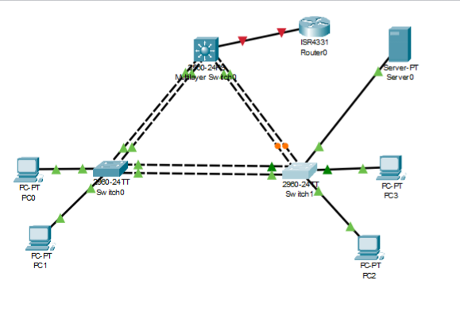
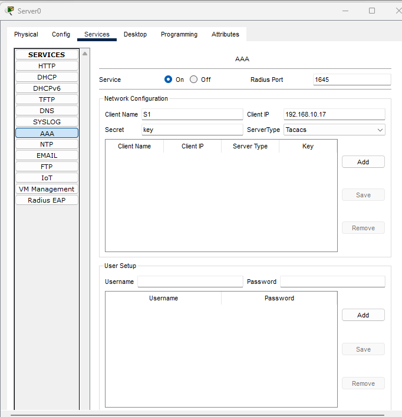
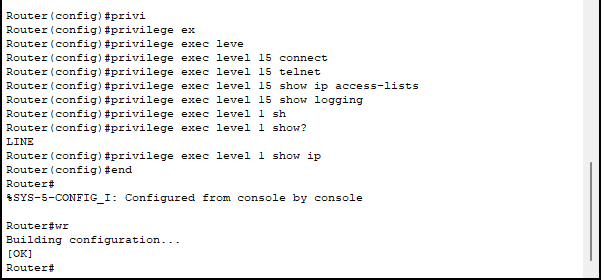

## RADIUS-vs-TACACS-Network-Security-Protocol-Comparison      /\ _ /\
### Previously uploaded: _'Enterprise Security Mode'_ https://github.com/ImaneLamriui/Securing-Enterprise-Access, utilizing a RADIUS server for Authentication, Authorization, and Accounting (AAA). Now, let's explore the contrast between _RADIUS and TACACS+_.

__RADIUS__ and __TACACS+__ are both __security protocols for authentication and authorization__ in networks, but they differ in how they handle these functions:

##### Mode of Operation:
__RADIUS__: Operates on a client-server model where network devices send authentication requests to the RADIUS server to verify user credentials.

__TACACS+__: Also follows a client-server model, but divides authentication, authorization, and accounting functions across separate servers for finer control.

##### Security:
__RADIUS__: Uses simpler and less robust encryption compared to TACACS+, potentially making it more vulnerable to attacks.

__TACACS+__: Provides stronger encryption, ensuring higher security in communication between the client and server.

##### Flexibility and Control:
__RADIUS__: Offers basic authentication and authorization, suitable for environments where less detailed control over user access is needed.

__TACACS+__: Provides greater granularity in authorization, allowing for more precise control over actions that authenticated users can perform.

##### Typical Uses:
__RADIUS__: Commonly used in environments where remote user authentication is needed, such as wireless networks or VPN connections.

__TACACS+__: More prevalent in corporate environments where detailed control over user actions is required, such as in the management of critical network devices.

### If we wanted to have centralized management of network devices:
#### - We could implement a RADIUS server or TACACS+ server in the network and configure the network devices to authenticate users. 
#### - We will set up a TACACS authentication server on the network using the Packet Tracer simulator.
##### Prerequisites: Installation of Cisco-Packet-Tracer-Software.
###### In this image, two VLANs have been configured and trunk connections have been verified.

#### - We add a server and configure the 'AAA' service on switch S1. We add the user 'raduser' with the a password.

  #### - Next, we connect the server to switch 1 on port FastEthernet 0/1 in access mode and belonging to VLAN1.

#### - Now, we proceed to configure the switch to authenticate users __first against the TACACS server__, and in case it fails to authenticate against the server, it should fall back to __local authentication__.

#### - We configure it so that if the authentication server goes down, there won't be any way to access the switches. With the following command, we instruct the switch to first attempt authentication through the RADIUS AAA server, and if that fails, it should check against the local switch users with the following command:

###### S1(config)# aaa authentication login vty group tacacs+ local

#### - We verified and _the Authentication for the RADIUS User_ is functioning correctly.
__The NSA Security Guide__ recommends modifying the privilege level of certain default level __'1'__ commands to level __'15'__.

The last command __privilege exec level 1 show ip__ sets the commands __show__ and __show ip__ at level __1__.

Save the configuration using the __wr__ command.

